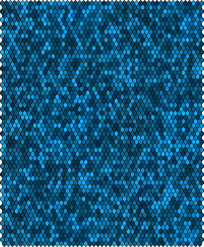
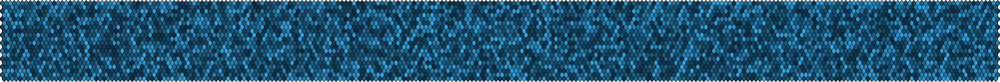
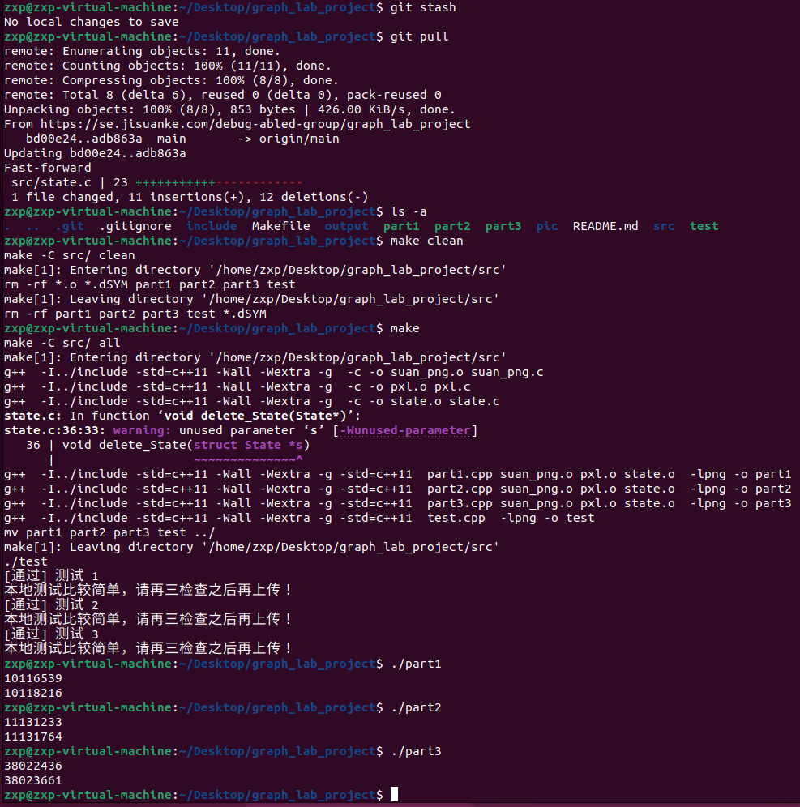

# graph_lab_project

[toc]

# 高速路网设计


## 工作分配

- 冉丰源：建图、调试

- 张须彭：次短路算法设计

- 肖一招：结构体、上传、测试

- 吴昊：最短路算法设计

**感谢小组内的所有成员！！！**


## 题目

### 题目描述

蒜国国王正准备为蒜国筹建第一条高速公路，他决定请你来当总设计师。
蒜国的次级行政机构叫州，每个州被划为正六边形，每个州最多与其他六个州相连，最少与一个州相连。
每个州都有数字编号，地图最左上角的州编号为 $1$，按从上到下，从左到右的顺序逐个增加，编号达到行尾会换行。
比如 `pic/test1.png` 中第一行州的编码从左到右分别是 $1，2，3，4；$第二行是 $5，6，7。$图上白色区域不属于城市，黑色的线条代表州界。

每个州有一个产业发达程度 $industry$，我们用不同的颜色来代表不同的产业发达程度，颜色越深代表该州的产业越发达。第 $i$ 个州的产业发达程度 $industry_i$的具体计算方法如下：

$$
industry_i = 255\times 255\times 3− R_i\times R_i− G_i\times G_i- B_i\times B_i.
$$

其中 $(R_i,G_i,B_i)$ 代表第 $i$ 个州的颜色。

国王要求你设计一条最左上角的州和最右下角的州连通的高速公路，只有相邻的州可以被高速公路连接，要求设计的高速公路经过的州产业发达程度之和尽可能小，以带动这些地方的产业升级，也就是说要尽量经过图上颜色浅的区域；但必须比能得到的最小值更大，以避免经过的州过于不发达导致公路难以维护（可以保证课上讲的次短路解法一定能够得出正确答案）。每个州只能被高速公路经过一次，**经过的州不包含第一个州**。

### 第一部分

第一部分中你负责为蒜国国王解决前面所说的问题。我们会给你一张地图，你需要观察地图，对地图进行解析。请注意：不同的地图上的州的图案是一样大的。你可以利用这个特性设计解析图片的函数。你可以自由地增加和实现数据结构 `State` 中的函数与变量。但是请注意，一定要在 `solve` 函数中返回正确答案，否则你可能会失去全部分数。本次实验测试规模较大，解法也十分多样。你只要选择合适的算法在指定的时间内完成即可得分。

请在 `state.c` 和 `state.h` 中完成：

- `void init_State(struct State *s)`

    State 的初始化函数；一个国家（State）对象包含了你从地图上读取到的全部信息（也就是这个国家的产业信息分布，所以该类型叫 State），你可以把它看作一个图的对象。

- `void delete_State(struct State *s)`

    State 的回收函数，释放图片的所有内存。

- `void parse(struct State *s, struct PNG *p)`

    解析图片，并将解析结果存到数据结构 `s` 中。 `src/pxl.c` 和 `src/suan_png.c` 这两个文件中已经实现好了 PNG 的常用函数，具体使用方法可查看具体代码。（不会对实现细节进行测试，但是每一步测试中我们会先调用这个函数，再调用下面的 `solve` 函数，这样设计是为了方便你分治问题并且 Debug）

- `int solve1(struct State *s)`

    这是一个解题函数，会在 `parse` 后被调用，用来返回一个正确答案，代表高速公路经过的州的产业发达程度之和最小值。

- `int solve2(struct State *s)`

    这是一个解题函数，会在 `parse` 后被调用，用来返回一个正确答案，代表高速公路经过的州的产业发达程度之和的次小值（即次短路，注意，这里的次短路**不允许重复经过同一个点**）。

### 关于本地测试

本次本地测试会对`solve1`、`solve2`和`parse`进行测试。你可以在终端中输入：

```bash
make
```

来编译执行本地判分器。

输入：

```bash
make clean
```

可以清空之前编译出的文件。

其它的`make`指令可以在`Makefile`中查看。

### 提交与在线判分

正如前面提到的，这次作业由在线判分器进行自动判分。在这次任务中，你可以修改绝大部分`.c`和头文件，对其他文件的修改将会被系统忽略。注意，本项目中有部分 C++ 代码，你无需阅读和修改，不影响完成本项目的代码。如果没有特殊说明，你不可以自行通过`standard output`输出任何内容（这意味着你**不可以**使用`printf`或类似的函数输出多余的内容），因为这会导致在线判分器判分失误从而影响你的成绩。在你提交作业后，自动判分器将针对你提交的内容进行一系列单元测试。你的最终成绩将取决于你通过的单元测试个数。


## 实现

### 主要工作

#### `state.h`

```c
#ifndef STATE_H_
#define STATE_H_
#include "suan_png.h"
#include "pxl.h"

#define MAX 65536
#define INF 0x3f3f3f3f

struct State
{
    // data structure
    int visited[MAX];
    int pathLength[MAX]; // 存路径长度
    int minPath[MAX];    // 存最短路路径
    int secondMinPath;   // 次短路
    int deletedEdge;     // 删去的边
    int row;
    int column;
};

// function
void init_State(struct State *s);
void delete_State(struct State *s);
void parse(struct State *s, struct PNG *p);
int solve1(struct State *s);
int solve2(struct State *s);

#endif
```

#### `state.c`

##### 引用、结构体和全局变量

```c
#include "state.h"
#include <string.h>

typedef struct Point
{
    int weight; // 点的权值
} PointWeight;  // 州的点集合

PointWeight Point[MAX];
int path[MAX];

typedef struct EdgeNode
{
    int vertex; // 终点坐标
    int next;
} Edge;

Edge edge[MAX];  // 边数组
int head[MAX];   // 头结点
int edgeNum = 0; // 边的数量
int nodeNum = 0;
```

##### 初始化（用了数组所以不填`delete_state()`）

```c
void init_State(struct State *s)
{
    for (int i = 0; i <= MAX; i++)
    {
        s->pathLength[i] = INF;
        s->visited[i] = 0;
        s->minPath[i] = 0;
        s->secondMinPath = INF;
    }
    s->row = 0, s->column = 0; // 初始化
    return;
}

void delete_State(struct State *s)
{
    // TODO
}
```

##### 建图


```c
int max(int x, int y)
{
    return x > y ? x : y;
}

void insertEdge(int u, int v)
{
    edge[++edgeNum].vertex = v;
    edge[edgeNum].next = head[u];
    head[u] = edgeNum;
}

void buildEdge(struct State *s, int weight, int column)
{
    int maxLine = s->column;
    Point[++nodeNum].weight = weight;
    if (s->row % 2 == 0)
    {
        insertEdge(nodeNum, nodeNum - maxLine);
        insertEdge(nodeNum - maxLine, nodeNum);
        insertEdge(nodeNum, nodeNum - maxLine + 1);
        insertEdge(nodeNum - maxLine + 1, nodeNum);
    }
    if (s->row % 2 == 1)
    {
        if (s->row > 1)
        {
            if (column < maxLine)
            {
                insertEdge(nodeNum, nodeNum - (maxLine - 1));
                insertEdge(nodeNum - (maxLine - 1), nodeNum);
            }
            if (column > 1)
            {
                insertEdge(nodeNum, nodeNum - (maxLine - 1) - 1);
                insertEdge(nodeNum - (maxLine - 1) - 1, nodeNum);
            }
        }
    }
    if (column > 1)
    {
        insertEdge(nodeNum, nodeNum - 1);
        insertEdge(nodeNum - 1, nodeNum);
    }
}

int calculateWeight(struct PNG *p, int w, int h)
{
    int r, g, b;
    r = get_PXL(p, w, h)->red;
    g = get_PXL(p, w, h)->green;
    b = get_PXL(p, w, h)->blue;
    return 255 * 255 * 3 - r * r - g * g - b * b;
}

void parse(struct State *s, struct PNG *p)
{
    int height = get_height(p);
    int width = get_width(p);
    int weight;
    s->row = 1;
    for (int h = 6; h < height; h += 8)
    {
        int line = 1;
        for (int w = 6; w < width; w += 8)
        {
            weight = calculateWeight(p, w, h);
            if (weight == 0)
            {
                continue;
            }
            buildEdge(s, weight, line);
            line++;
        }
        if (s->row == 1)
        {
            s->column = line - 1;
        }
        line = 1;
        (s->row)++;
    }
    return;
}
```

##### 最短路径


```c
int solve1(struct State *s)
{
    // TODO
    s->visited[1] = 1;
    s->pathLength[1] = 0;
    s->minPath[1] = -1;
    int k = 1;            // 加入路径的点的数量
    int currentPoint = 1; // 当前所选择的点
    while (k < nodeNum)
    {
        for (int i = head[currentPoint]; i != 0; i = edge[i].next)
        {
            if (!s->visited[edge[i].vertex] && s->pathLength[edge[i].vertex] > s->pathLength[currentPoint] + Point[edge[i].vertex].weight)
            {
                s->pathLength[edge[i].vertex] = s->pathLength[currentPoint] + Point[edge[i].vertex].weight;
                s->minPath[edge[i].vertex] = currentPoint;
            }
        }
        int minDistance = INF;
        for (int i = 1; i <= nodeNum; i++)
        {
            if (!s->visited[i] && minDistance > s->pathLength[i])
            {
                currentPoint = i;
                minDistance = s->pathLength[i];
            }
        }
        s->visited[currentPoint] = 1;
        s->pathLength[currentPoint] = minDistance;
        k++;
    }
    return s->pathLength[nodeNum];
}
```

##### 次短路径


```c
int solve2(struct State *s)
{
    // TODO
    int u = 0; //
    int minLength = s->pathLength[nodeNum];
    for (int i = nodeNum; i != -1; i = s->minPath[i])
    {
        u = s->minPath[i];
        int tempEdge = 0;
        for (int p = head[u]; p; p = edge[p].next)
        {
            if (edge[p].vertex == i)
            {
                tempEdge = p;
                break;
            }
        }
        s->deletedEdge = tempEdge; // 删除边
        // dijkstra
        memset(s->visited, 0, sizeof(s->visited));
        for (int i = 0; i <= MAX; i++)
        {
            s->pathLength[i] = INF;
        }
        s->visited[1] = 1;
        s->pathLength[1] = 0;
        int k = 1;            // 加入路径的点的数量
        int currentPoint = 1; // 当前所选择的点
        while (k < nodeNum)
        {
            for (int i = head[currentPoint]; i != 0; i = edge[i].next)
            {
                if (i != s->deletedEdge && !s->visited[edge[i].vertex] && s->pathLength[edge[i].vertex] > s->pathLength[currentPoint] + Point[edge[i].vertex].weight)
                {
                    s->pathLength[edge[i].vertex] = s->pathLength[currentPoint] + Point[edge[i].vertex].weight;
                }
            }
            int minDistance = INF;
            for (int i = 1; i <= nodeNum; i++)
            {
                if (!s->visited[i] && minDistance > s->pathLength[i])
                {
                    currentPoint = i;
                    minDistance = s->pathLength[i];
                }
            }
            if (minDistance == INF)
            {
                break;
            }
            s->visited[currentPoint] = 1;
            s->pathLength[currentPoint] = minDistance;
            k++;
        }
        if (s->pathLength[nodeNum] > minLength && s->secondMinPath > s->pathLength[nodeNum])
        {
            s->secondMinPath = s->pathLength[nodeNum];
        }
    }
    return s->secondMinPath;
}

```


### 测试图片（*.png）及应得答案

---

#### Test 1

565 * 241，2065 个点


Result for Test 1：

```
10116539
10118216

```

---

#### Test 2

485 * 401，2970 个点



Result for Test 2：

```
11131233
11131764

```

---

#### Test 3

165 * 2001，4990 个点



Result for Test 3：

```
38022436
38023661

```

---


### 最后的测试结果



完全正确

**再次感谢小组内的所有成员！！！**

